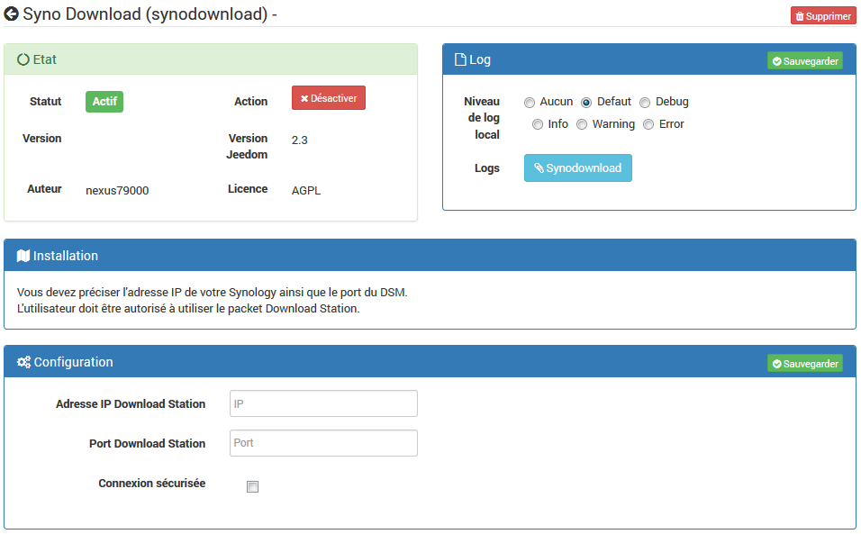
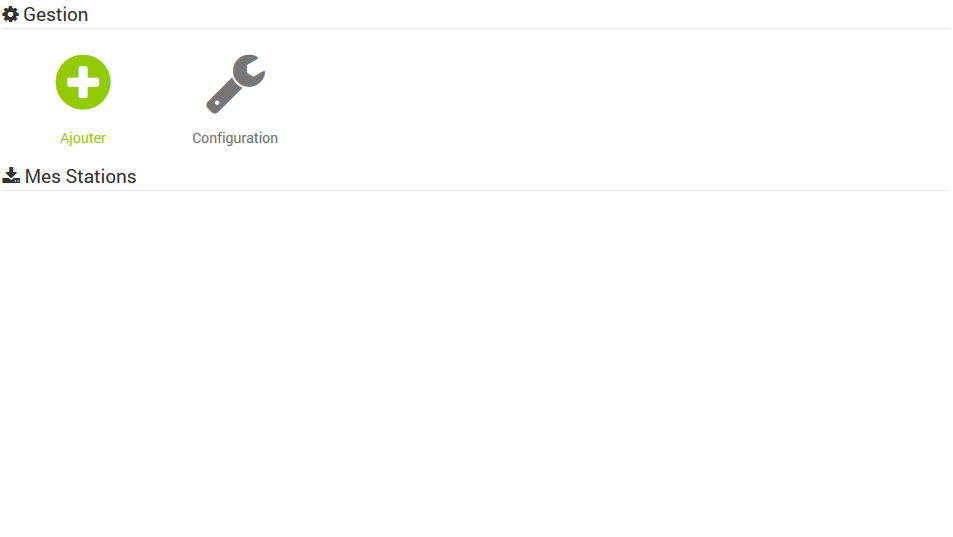
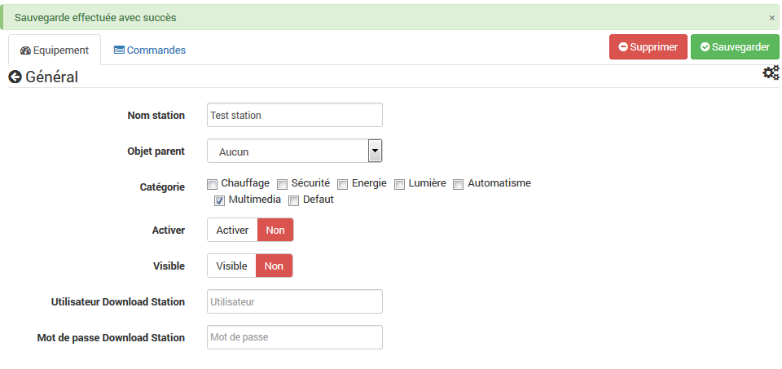
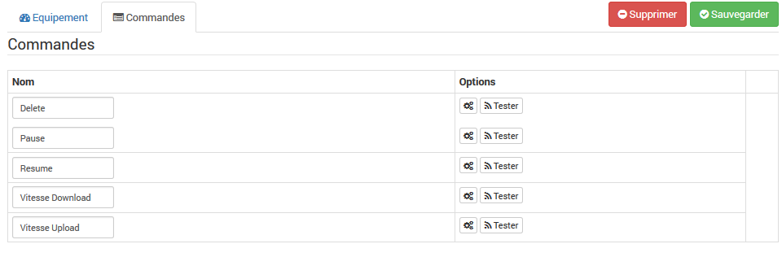
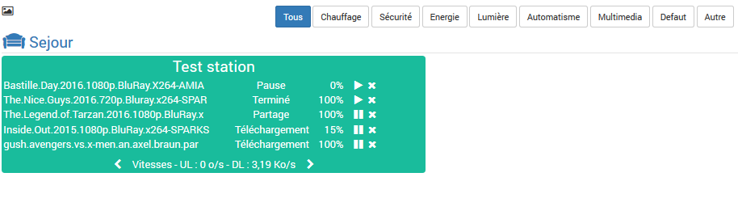

The synodownload plugin allows you to connect to your nas and to control Download Station. It will allow you to see the status of downloads according to the configured users. Possible actions on downloads are: Resume, pause, delete, ...

Configuration =============

After downloading the plugin, activate it:

Fill in the IP or DNS address and port of your nas hosting Synology Download Station. The secure mode makes it possible to pass the requests in https (to verify that the port is indeed the port https).

Then go to the plugin tab to add download stations.

Equipment configuration -----------------------------

The configuration of the stations is accessible from the plugin menu:

You have to add a station, choose a name and here you are on the configuration page:

Assign an object (part) to your station, select the visibility and activation of the equipment. Do not forget to specify the user and password of connection to your nas. Then save.

> **Tip**
>
> Un utilisateur avec les droits admin sur le nas voit tous les téléchargement de tous les autres utilisateurs. 
> Un utilisateur 'Normal' ne voit que ses propres téléchargement.

There are only five default managed commands. The other commands are managed by the plugin depending on the number of downloads. Here are the default commands:

Voici le dashboard avec quelques téléchargements : 

FAQ ---
* The plugin does not update in real time:
For reasons of performance, the plugin is updated every 15 minutes and all actions of the plugins.