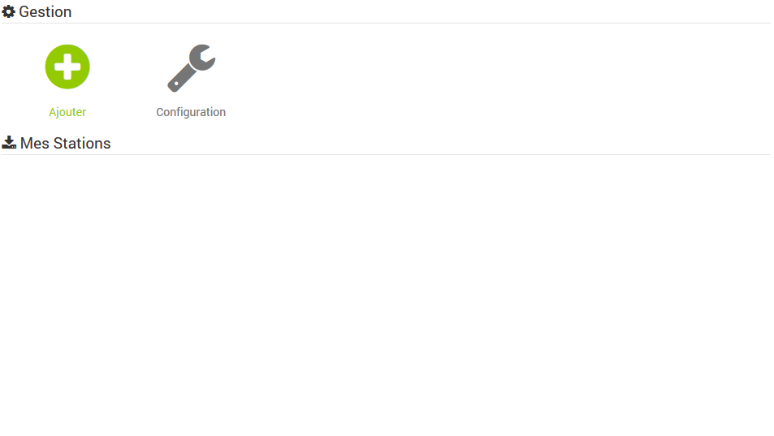
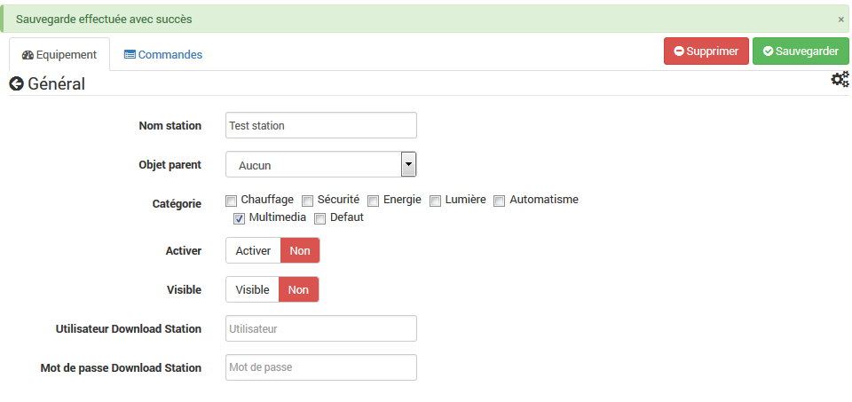
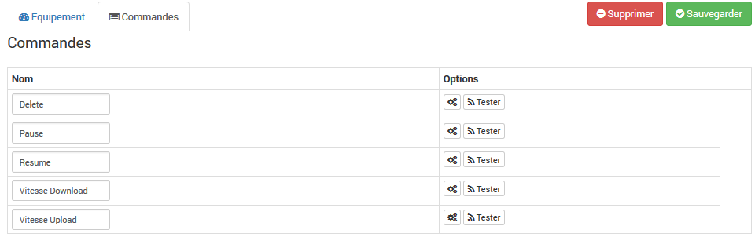

El complemento Synodownload te permite conectarte a tu nas y controlar Download Station. Le permitirá ver el estado de las descargas según los usuarios configurados. Las posibles acciones en las descargas son: reanudar, pausar, eliminar, ...

Configuración =============

Después de descargar el plugin, actívalo:

Complete la dirección IP o DNS y el puerto de su nas que contiene Synology Download Station. El modo seguro hace posible pasar las solicitudes en https (para verificar que el puerto sea efectivamente el puerto https).

Luego vaya a la pestaña del complemento para agregar estaciones de descarga.

Configuración del equipo -----------------------------

La configuración de las estaciones es accesible desde el menú del plugin:

Debe agregar una estación, elegir un nombre y aquí está en la página de configuración:

Asigne un objeto (parte) a su estación, seleccione la visibilidad y la activación del equipo. No olvide especificar el usuario y la contraseña de conexión a su nas. Luego guarda.

> **Tip**
>
> Un utilisateur avec les droits admin sur le nas voit tous les téléchargement de tous les autres utilisateurs. 
> Un utilisateur 'Normal' ne voit que ses propres téléchargement.

Sólo hay cinco comandos gestionados por defecto. Los otros comandos son gestionados por el complemento en función del número de descargas. Aquí están los comandos por defecto:

Voici le dashboard avec quelques téléchargements : 

Preguntas frecuentes ---
* El plugin no se actualiza en tiempo real:
Por razones de rendimiento, el complemento se actualiza cada 15 minutos y todas las acciones de los complementos.