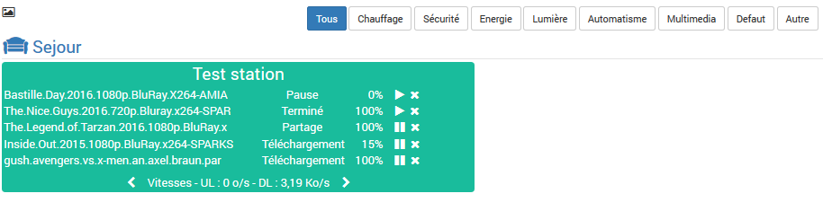

Le plugin synodownload permet de se connecter à votre nas et de contrôler Download Station. Il va vous permettre de voir l'état des téléchargements en fonction des utilisateurs configurés. Les action possible sur les téléchargements sont les suivants : Resume, pause, supprimer, ...

Configuration
=============

Après téléchargement du plugin, il faut activer celui-ci:

Renseignez l'adresse IP ou DNS et le port de votre nas hébergeant Synology Download Station. Le mode sécurisé permet de passer les requêtes en https (Verifier que le port soit bien le port https).

Ensuite rendez-vous dans l'onglet du plugin pour ajouter des stations de téléchargement.

Configuration des équipements
-----------------------------

La configuration des stations est accessible à partir du menu plugin : 

Il faut ajouter une station, choisir un nom et vous voilà sur la page de configuration :

Affectez un objet (pièce) à votre station, selectionnez la visibilité et l'activation de l'équipement. N'oubliez pas de préciser le user et mot de passe de connection à votre nas. Ensuite ,sauvegardez.

> **Tip**
>
> Un utilisateur avec les droits admin sur le nas voit tous les téléchargement de tous les autres utilisateurs. 
> Un utilisateur 'Normal' ne voit que ses propres téléchargement.

Il y a seulement cinq commandes de géré par defaut. Les autres commande sont gérées par le plugin en fonction du nombre de téléchargement.
Voici les commande par défaut :

Voici le dashboard avec quelques téléchargements : 

FAQ
---
* Le plugin ne se met pas à jour en temps réel :  
Pour des raisons de performance, le plugin se met a jour toutes les 15 minutes et sur toutes les actions du plugins.